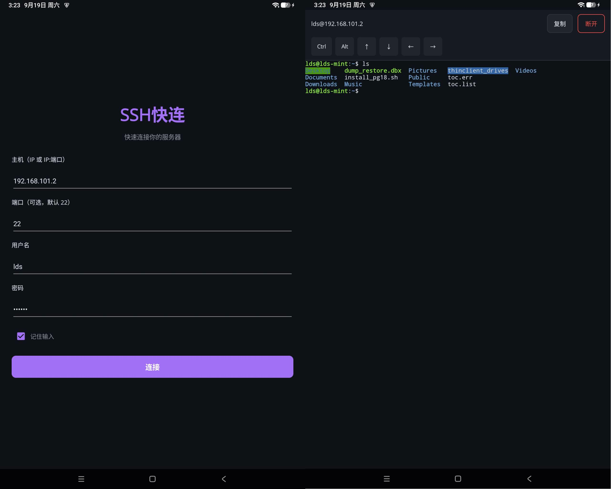

# SSH快连

基于.NET MAUI的安卓轻量SSH，在安卓上连接并操作服务器。

## 功能

- **连接页**：主机IP、端口、用户名、密码，支持「记住输入」，连接后进入终端页。
- **终端页**：基于 [xterm.js](https://xtermjs.org/) 的完整终端模拟器，
  通过本地 WebSocket 桥（Fleck）+ [SSH.NET](https://github.com/sshnet/SSH.NET) 的 ShellStream 与服务器交互，
  支持 ANSI 颜色、光标、滚动、窗口自适应
- 终端页顶栏提供手机键盘上没有的功能键

<div align="center">
  
</div>

## 技术架构

```
ConnectPage ──SSH连接──> SshSession(SshClient + ShellStream)
                              ▲   │  数据
                              │   ▼
                        TerminalBridge（Fleck 本地 WebSocket 服务器，127.0.0.1:22886）
                              ▲   │  ws://
                              │   ▼
              TerminalPage（WebView + xterm.js）
```

## 项目架构与技术栈

> [技术文档](MarkDown/技术文档.md)


## 许可证

本项目基于 [MIT](LICENSE) 许可开源。
